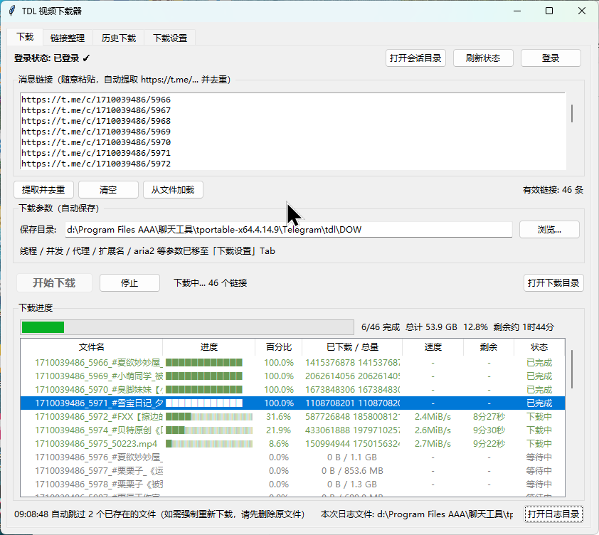
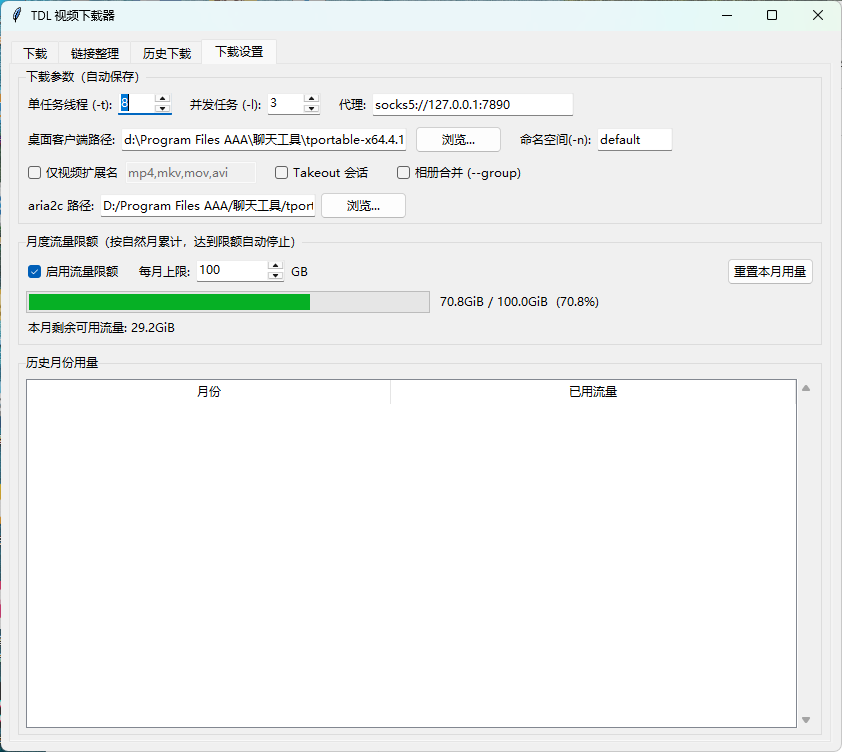

# TDL 下载器

**Telegram（电报）资源下载器** —— `tdl` 的 Windows 图形界面封装（tkinter）。把命令行工具 `tdl` + `aria2` 包装成开箱即用的多任务下载器，用来批量下载 **Telegram 频道 / 群组 / 会话里的视频、图片、文件**，支持实时进度、历史记录、流量统计与链接整理。

> 本项目是 [iyear/tdl](https://github.com/iyear/tdl) 的 GUI 前端，遵循上游 **AGPL-3.0** 许可。下载能力全部由 `tdl` 与 `aria2` 提供。

---

## 支持的 Telegram 资源

所有下载都通过 Telegram 官方 API 进行，登录你自己的账号后即可访问其可见内容：

| 资源类型 | 说明 |
|---|---|
| **视频** | `mp4` / `mkv` / `mov` / `avi` 等，可只下视频忽略其他文件 |
| **图片** | 频道与群组中的图片消息 |
| **文件 / 文档** | 任意类型的附件 |
| **音乐 / 音频** | 音频消息与音频文件 |
| **频道 / 群组** | 按链接批量下载整个频道或群组的媒体 |
| **私聊 / 收藏夹** | 自己会话中的消息与「已保存消息」 |
| **话题 / 评论区** | 支持带话题的群组与评论内容 |
| **受限内容** | 开启 takeout 会话后可导出受保护频道的内容 |

链接格式支持 `https://t.me/...`（含 `c/` 私有频道、`?single` 单条消息等）。

---

## 功能特性

- **多任务下载**：粘贴一批 `https://t.me/...` 链接，自动提取、去重，按链接原顺序排列
- **实时进度**：每个文件的进度条、速度、剩余时间、总体进度一屏可见
- **aria2 加速**：多线程分片下载，可调并发数与单文件连接数
- **自动跳过已下载**：输出目录中已存在的文件不再重复下载
- **断点续传**：中断后重跑，aria2 从已完成分片继续
- **收尾自动改名**：下完自动去掉 `.part` 后缀，转正为正式文件名
- **内置登录**：桌面客户端 / 二维码 / 手机号验证码三种方式
- **历史下载**：按次记录 + 文件级清单，可扫描输出目录重建
- **流量统计**：按自然月累计下载量，可设月度限额
- **链接整理**：批量去重、按结尾数字排序、筛选
- **类型过滤**：仅视频模式、自定义扩展名白名单

---

## 界面预览

**下载页** —— 链接自动提取去重，实时显示每个文件的进度、速度、剩余时间与总体进度：



**下载设置页** —— 线程/并发/代理、视频过滤、流量限额：



---

## 环境要求

| 项目 | 要求 |
|---|---|
| 操作系统 | Windows 10 / 11 |
| Python | 3.8 或更高（需含 tkinter，官方安装包默认自带） |
| 第三方库 | **无需任何 pip 安装**，仅用标准库 |
| 外部程序 | `tdl.exe`、`aria2c.exe`（需自行下载，见下） |

### 关于依赖

本项目**不依赖任何第三方 Python 包**，只用标准库：

```
os  re  sys  json  socket  time  threading  subprocess
queue  datetime  urllib.request  tkinter (tk/ttk/filedialog/messagebox)
```

因此不需要 `requirements.txt`，也不需要联网 `pip install`。

---

## 安装步骤

有两种方式，**推荐方式 A**（不用装 Python）。

### 方式 A：下载 exe（推荐）

1. 打开 [Releases](https://github.com/Banxiaxiala/TDL-Downloader/releases)，下载 `TDL-Downloader-v1.0.0.exe`
2. 放到一个**独立空文件夹**（如 `D:\TDL\`）
3. 同目录放好 `tdl.exe` 和 `aria2\aria2c.exe`（见下方「放置二进制文件」）
4. 双击 exe 启动

### 方式 B：从源码运行

需自备 Python 3.8+（无需 `pip install`，本项目零第三方依赖）：

```bash
git clone https://github.com/Banxiaxiala/TDL-Downloader.git
cd TDL-Downloader
```

然后按下方「放置二进制文件」放好依赖，双击 `启动TDL下载器.bat`，或命令行运行：

```bash
pythonw tdl_gui.pyw
```

### 放置二进制文件（两种方式都需要）

本仓库与 Release **均不包含** `tdl.exe`、`aria2c.exe`（体积大且上游更新频繁），需自行下载：

**tdl.exe** —— 下载后放在程序根目录：

- 来源：<https://github.com/iyear/tdl/releases>
- 选择 `tdl_Windows_64bit.zip`，解压得到 `tdl.exe`
- 放置路径：与主程序同目录，如 `D:\TDL\tdl.exe`
- 本 GUI 适配的版本：**0.20.3**（其他版本多数兼容）

**aria2c.exe** —— 下载后放在 `aria2/` 子目录：

- 来源：<https://github.com/aria2/aria2/releases>
- 选择 `aria2-*-win-64bit-build1.zip`，解压得到 `aria2c.exe`
- 放置路径：`D:\TDL\aria2\aria2c.exe`（**必须在 `aria2` 子目录下**）

放好后目录结构应为：

```
D:\TDL\                      ← 你新建的文件夹
├── TDL-Downloader-v1.0.0.exe   # 主程序（方式 A）
├── tdl.exe                     # ← 手动放置
├── aria2/
│   └── aria2c.exe              # ← 手动放置
└── config.json                 # 首次保存设置后自动生成
```

> 方式 B（源码）则是 `tdl_gui.pyw` + `启动TDL下载器.bat` 替代 exe。

首次启动后在 **下载设置** 页点保存即会生成 `config.json`（默认配置见下文）。

---

## 操作指南

### 一、首次准备

1. 把程序放到一个**独立文件夹**（推荐新建，如 `D:\TDL\`）
2. 同目录放好 `tdl.exe` 和 `aria2\aria2c.exe`（见上文「安装步骤」）
3. 启动程序，先到 **下载设置** 页确认这几项：
   - **输出目录**：想存到哪就改成哪（默认为程序目录下的 `DOW`）
   - **代理**：默认 `socks5://127.0.0.1:7890`，没有代理就**清空**（否则连不上）
   - **并发数**：同时下载几个文件，建议 3~5（太高易被限流）
   - **线程数**：单文件分片连接数，建议 8~16

改完点 **保存设置**。

### 二、登录 Telegram

点顶部 **登录** 按钮，选一种方式：

| 方式 | 适用场景 | 操作 |
|---|---|---|
| **桌面客户端**（推荐） | 电脑上已装并登录 Telegram Desktop | 直接点，自动复用现有会话 |
| **二维码** | 手机上已登录 Telegram | 点后弹出二维码，用手机 Telegram 扫 |
| **手机号 + 验证码** | 全新登录 | 输入手机号（含国家码，如 `+8613800138000`），再填 Telegram 收到的验证码 |

> - 首次登录会有独立控制台窗口，按提示交互即可，完成后自动关闭
> - 若账号开了两步验证，会额外要求输入密码
> - 登录状态保存在 `~/.tdl/data`，可点 **打开会话目录** 查看，一般只需登录一次

### 三、下载资源

1. 打开 **下载** 页
2. 把 Telegram 链接粘进上方文本框，**一行一个，也可以直接粘一大段聊天记录**——程序会自动提取其中的 `https://t.me/...` 链接并去重
3. 支持的链接格式：
   - 频道/群组：`https://t.me/频道名`
   - 私有频道：`https://t.me/c/1234567890/123`
   - 单条消息：`https://t.me/频道名/123`
   - 合集：`https://t.me/频道名/123?single`
4. 点 **开始下载**

下载过程中列表会实时显示：

| 列 | 含义 |
|---|---|
| 文件名 | 最终保存的文件名 |
| 进度条 | 该文件的完成比例 |
| 进度 | 百分比 |
| 大小 | 已下载 / 总量 |
| 速度 | 实时下载速度 |
| 剩余 | 预计剩余时间 |
| 状态 | 等待中 / 下载中 / 已完成 / 出错 |

> **视频专属**：只想下视频，在 **下载设置** 勾选「仅下载视频」，并在扩展名框填 `mp4,mkv,mov,avi`。

### 四、断点续传与重跑

- **中断了？** 直接重新粘贴同一批链接、点开始下载即可
- 已下完的文件会被自动识别并标为「已完成」，不会重下
- 未下完的 `.part` 文件，只要旁边的 `.part.aria2` 控制文件还在，就会从断点继续
- **想强制重下某个文件**：先删除该文件（连同 `.part` / `.part.aria2`），再重新下载

### 五、链接整理

**链接整理** 页用于批量处理链接：

- 粘贴一批链接，点 **去重** 移除重复项
- 点 **升序 / 降序** 按链接结尾的数字排序（适合按集数整理）
- 整理好的结果可一键 **发送到下载页**

### 六、历史下载

**历史下载** 页记录每次下载任务：

- 上半部分：按次记录（时间、链接数、成功数）
- 下半部分：文件级清单（文件名、大小、状态、路径）
- **扫描输出目录**：以磁盘上的实际文件为准，重建清单——适合在手动增删文件、或清单与实际不符后执行

### 七、流量统计

**流量统计** 页按自然月累计下载量：

- 到 **下载设置** 勾选「启用月度限额」并填写上限（GB）
- 超额后程序会提示，避免流量超支

### 八、常见操作速查

| 我想…… | 怎么做 |
|---|---|
| 下某个频道的全部视频 | 粘频道链接 + 勾选「仅下载视频」 |
| 下某一条消息 | 粘 `https://t.me/频道名/消息ID` |
| 换个盘存 | **下载设置** → 输出目录 → 保存 |
| 提速 | 调大 **线程数**（受代理带宽限制） |
| 只下最近几集 | 先 **链接整理** 按数字降序，再删掉多余的 |
| 清空列表重新来 | 下载页点 **清空** |

---

## 配置项说明

配置保存在项目根目录 `config.json`，首次启动自动生成：

| 配置项 | 默认值 | 说明 |
|---|---|---|
| `out_dir` | `<项目目录>/DOW` | 下载输出目录 |
| `threads` | `8` | 单文件分片连接数 |
| `limit` | `4` | 同时下载的文件数 |
| `proxy` | `socks5://127.0.0.1:7890` | 代理地址，留空则直连 |
| `video_only` | `false` | 仅下载视频文件 |
| `video_ext` | `mp4,mkv,mov,avi` | 视频扩展名过滤 |
| `takeout` | `false` | 使用 takeout 会话（导出受限内容时启用） |
| `group` | `false` | 按群组分类存放 |
| `desktop_path` | 项目上级目录 | Telegram Desktop 数据目录 |
| `namespace` | `default` | tdl 登录命名空间 |
| `sort_desc` | `false` | 链接整理是否降序 |
| `aria2_path` | 空 | 自定义 `aria2c.exe` 路径，空则用 `aria2/aria2c.exe` |
| `quota_enable` | `false` | 是否启用月度流量限额 |
| `quota_gb` | `2` | 月度流量上限（GB） |

> `config.json` 含本机绝对路径等个人信息，已在 `.gitignore` 中排除，不会被提交。

---

## 常见问题

**Q：提示找不到 `tdl.exe` / `aria2c.exe`？**
按「安装步骤 2」下载并放到正确路径。`aria2c.exe` 必须放在 `aria2/` 子目录下。

**Q：下载完文件名还带 `.part`？**
`.part` 表示未下完。若数据已完整但没转正，通常是残留的 `tdl.exe` / `aria2c.exe` 进程占着文件句柄。程序收尾时会自动清理残留进程并重试改名；仍失败会在日志中提示手动去掉 `.part`。

**Q：上次中断的 `.part` 能续传吗？**
能——只要同目录下还有对应的 `.part.aria2` 控制文件，重跑即从断点继续。若控制文件已丢（如进程被强杀），该文件只能从头下载。

**Q：下载速度慢 / 连不上？**
检查代理设置（默认 `socks5://127.0.0.1:7890`）。速度上限取决于你的代理与 Telegram 账号类型。

**Q：`tdl serve 断连`？**
网络或代理不稳定导致。重跑即可，已下完的文件会自动跳过，未下完的续传。

**Q：日志在哪？**
项目根目录 `logs/`，按启动时间命名。

---

## 项目结构

```
TDL-Downloader/
├── tdl_gui.pyw            # 主程序（GUI 全部逻辑）
├── 启动TDL下载器.bat       # 启动脚本（自动查找 pythonw.exe）
├── docs/                  # README 截图
├── .gitignore             # 排除二进制、运行时数据、下载内容
├── README.md              # 本文档
└── LICENSE                # AGPL-3.0（继承自 iyear/tdl）
```

---

## 许可

本项目基于 [iyear/tdl](https://github.com/iyear/tdl) 构建，遵循 **AGPL-3.0** 许可协议。

`tdl` 与 `aria2` 的版权归各自作者所有。本仓库仅提供图形界面封装层。
